# 下载

1. [flutter 下载地址]('https://docs.flutter.dev/get-started/install/windows')
2. [Androdi Studio 下载地址]('https://developer.android.google.cn/studio?hl=zh-cn')
3. [Androdi Studio 汉化下载]('https://plugins.jetbrains.com/plugin/13710-chinese-simplified-language-pack----/versions#tabs')

# Androdi Studio 安装

1.  安装会有安装路径提示，自己决定安装的路径
2.  安装后运行软件，选择 Custom 自定义安装  
     **sdk 路径不能有空格，中文**
    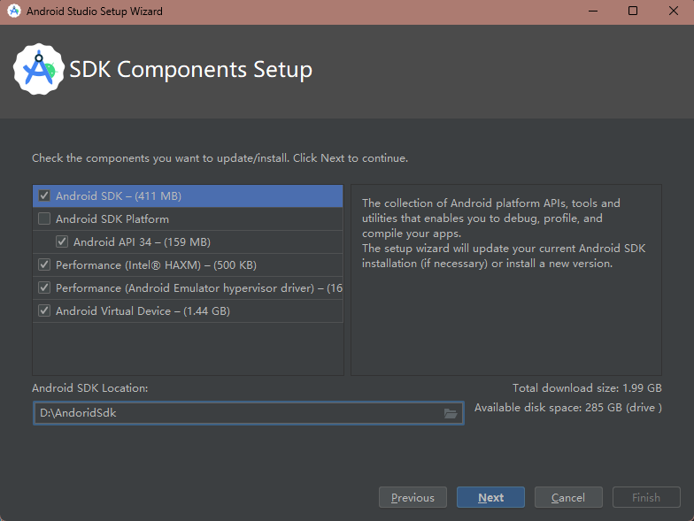
    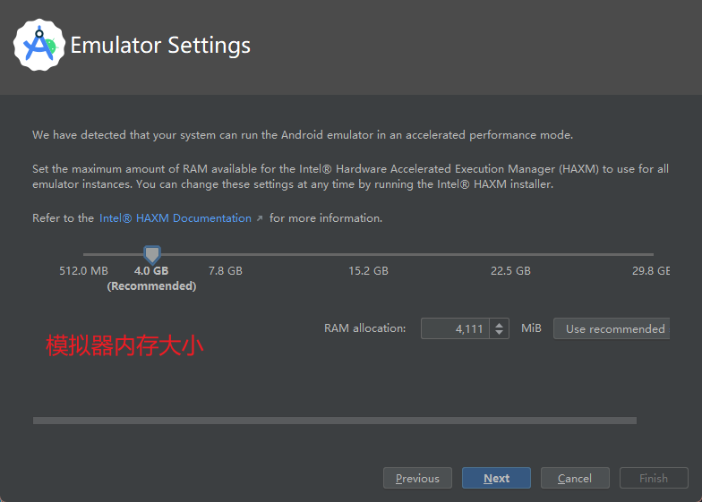
    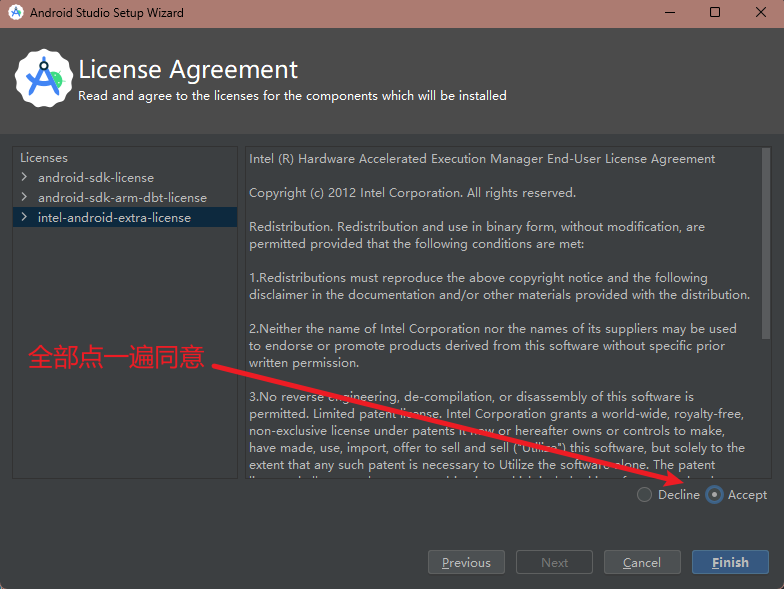
3.  汉化
    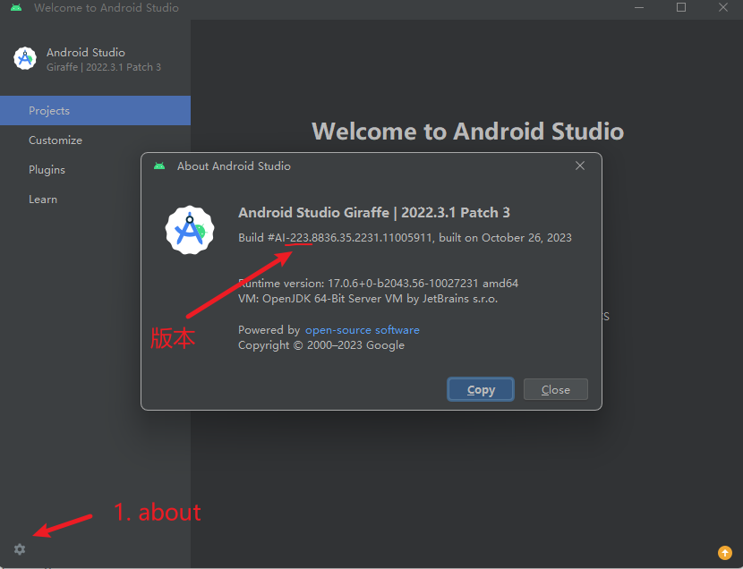
    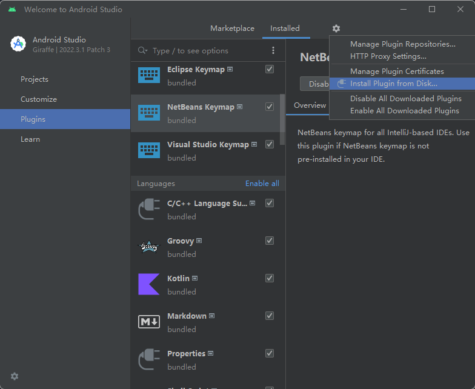

# flutter 安装

1. 解压文件到指定文件夹 eg: D:\flutter
2. 配置环境变量
   - path : D:\flutter\bin
   - FLUTTER_STORAGE_BASE_URL : https://storage.flutter-io.cn
   - PUB_HOSTED_URL : https://pub.flutter-io.cn
   - ANDROID_HOME : D:\AndoridSdk
   - path 添加 %ANDROID_HOME%\platform-tools 和 %ANDROID_HOME%\tools
3. win + r ，

   1. 输入 cmd 打开控制台，
   2. 输入 where flutter dart，显示如图，会有些微出入
      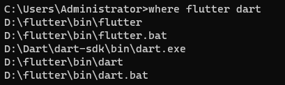

   3. 输入 flutter doctor，运行过程中会检查你现有的环境，并将检测结果以报告形式呈现出来。仔细阅读它显示的内容，检查是否有尚未安装的软件或是有其他的步骤需要完成（通常会以粗体呈现）。
      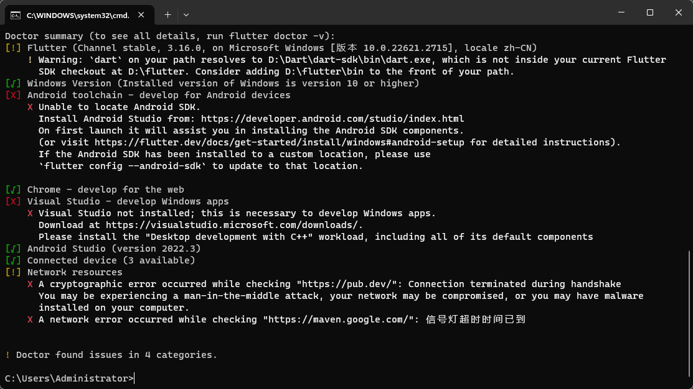
      - 解释
        |名称|含义|
        |:-:|:-:|
        |Flutter|flutter 的一些信息|
        |Windows Version| |
        |Android toolchain| |
        |Visual Studio| |
        |Android Studio| |
        |Connected device|连接设备|
      - 第一项提示，是因为安装过 dart，可以忽略或者删除 dart
      - Android toolchain 报错是因为需要安装 andorid sdk，使用 flutter config --android-sdk "SDK 路径" 进行安装，**路径不能有空格，中文**
        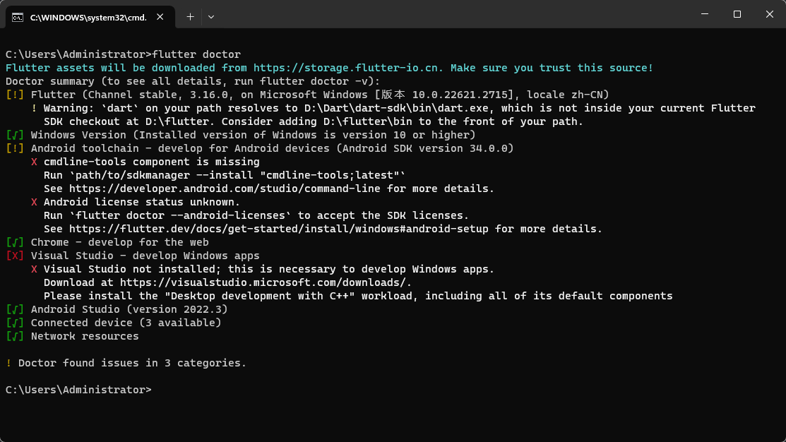
        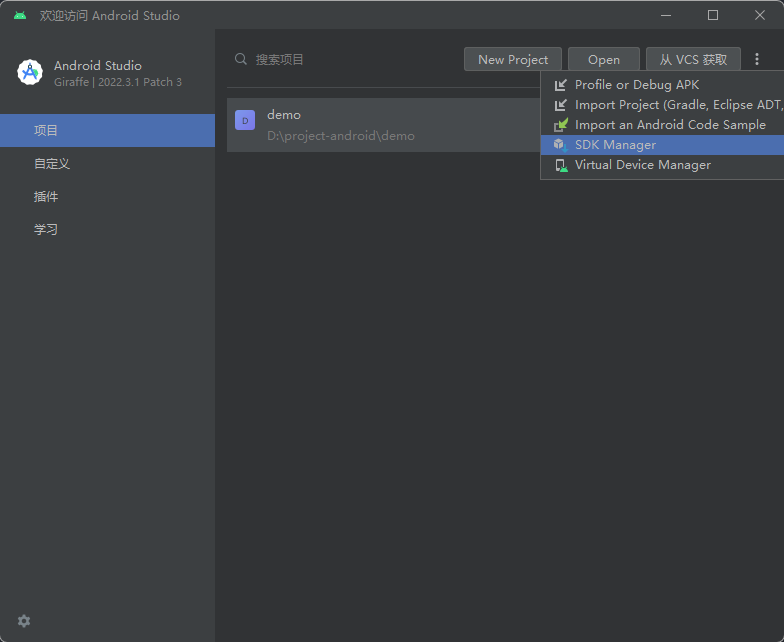
        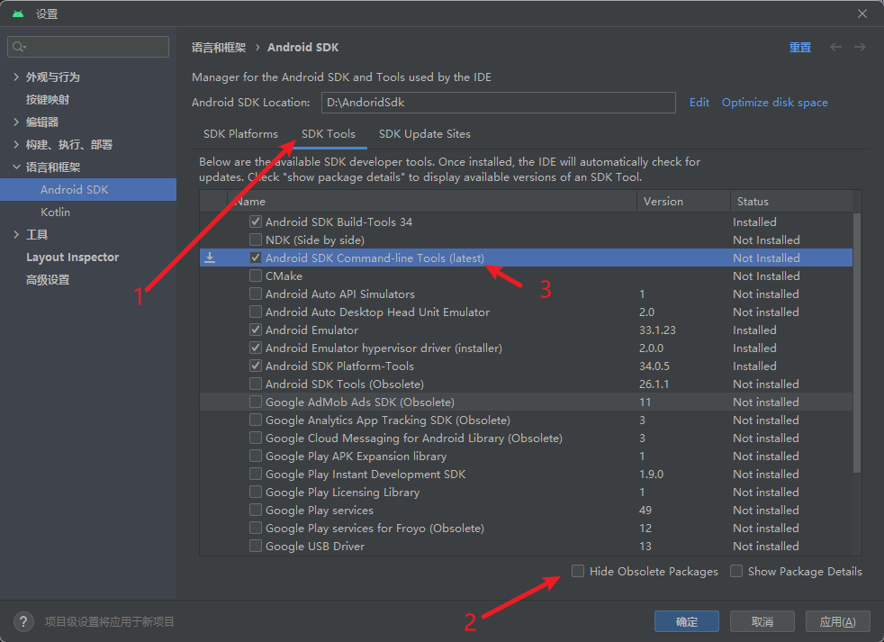
        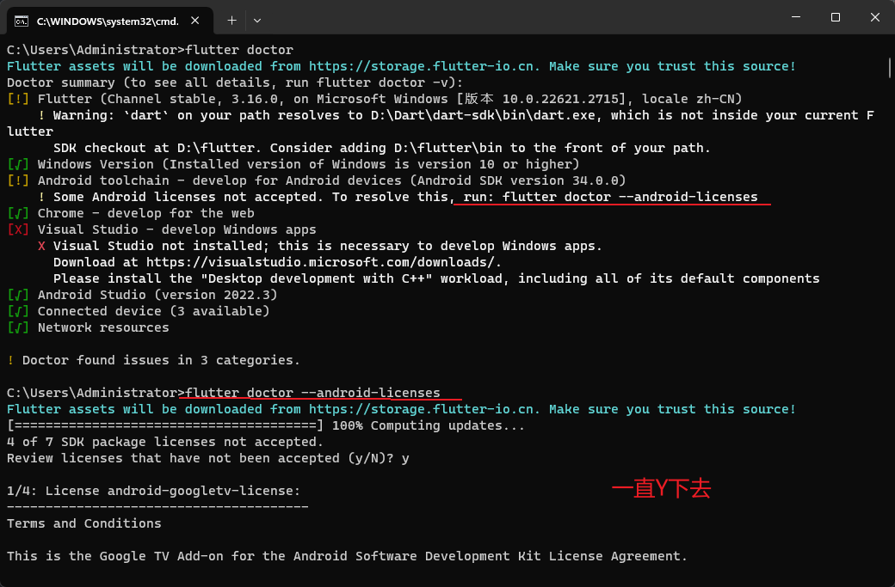
        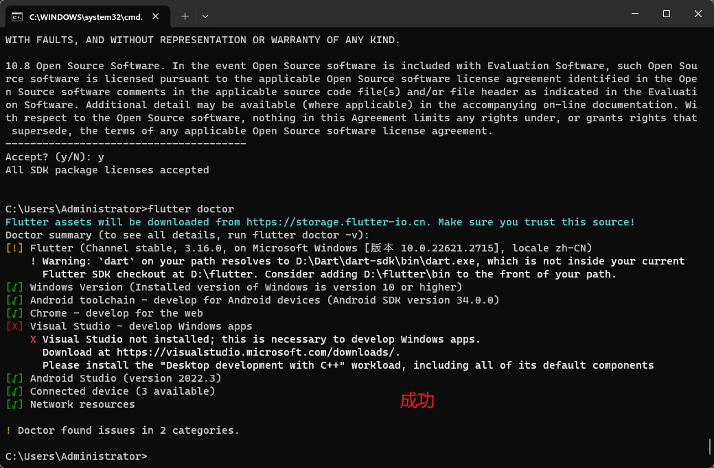

# flutter 项目

1. 创建项目 flutter create name
2. 进入编辑器，根据提示安装 dart flutter 两个插件
3. 加载依赖 pub get
